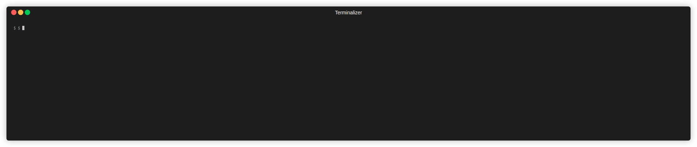

# LlamaSpit

LllamaSpit is a Go program that interacts with an Ollama HTTP endpoint to generate executable bash commands based on a provided narrative description of a certain task. The generated command is presented to the user who can choose either to execute it or decline it.
## Usage
### Instructions
The program is run as follows:
```
./llamaspit <Description of the command you want>
```
Or to run the program with Docker Compose:
```
docker compose run llamaspit <Description of the command you want>
```
Please replace `<Description of the command you want>` with your description of the command to be executed.

### Example usage

```
./llamaspit multiply 37 by 73
llamaspit suggests: `echo $((37 * 73))`
Do you want to execute the command? (y/n)
y
+ echo 2701
2701
```
### Full usage
```
./llamaspit -h
Usage: llamaspit [options] <description of the desired command>
Options:
-h/--help       Display this help text
-y              Automatically accept and execute the command
Environment Variables:
OLLAMA_HOST     The URL of the Ollama endpoint, defaults to http://localhost:11434
```

## Build
To build and run the program with Go, execute the following command on your terminal:

```
go build
```

Alternatively, to build and run the program with Docker Compose, execute the following command on your terminal:
```
docker compose build
```


## Testing

To run the tests, execute the following command on your terminal:
```
go test
```

To run the tests with Docker Compose, execute the following command on your terminal:
```
docker compose run llamaspit go test

```